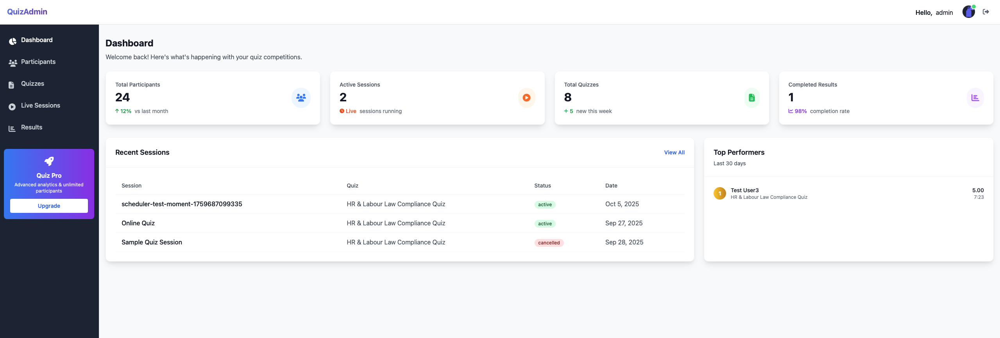
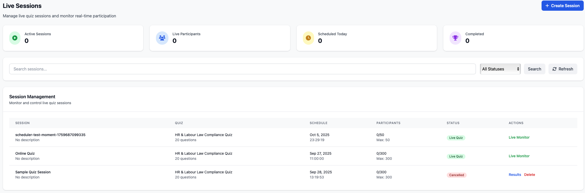
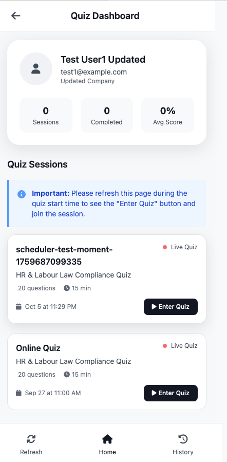
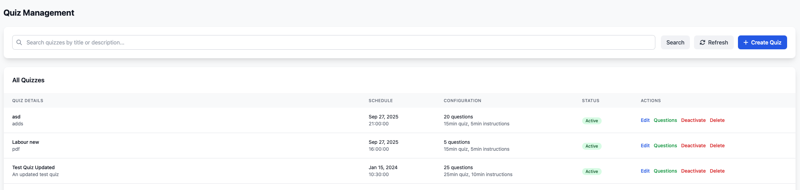
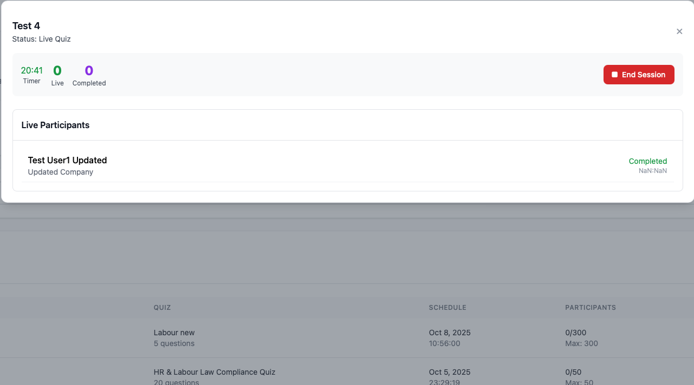
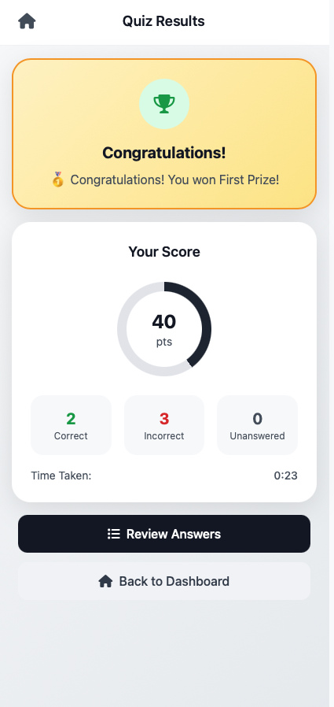

# 🎯 Live Quiz Competition Platform

A comprehensive, open-source Node.js + PostgreSQL application for conducting real-time quiz competitions with up to 1000 concurrent participants. Perfect for HR compliance training, educational assessments, corporate competitions, and more.

[](https://nodejs.org/)
[](https://postgresql.org/)
[](LICENSE)
[](https://github.com)

## 📸 Screenshots

| Admin Dashboard | Live Quiz Session | Participant View |
|----------------|-------------------|------------------|
|  |  |  |

| Quiz Management | Session Monitoring | Results Display |
|----------------|-------------------|-----------------|
|  |  |  |

[View all Screenshots →](Screenshots/)

## ✨ Why Choose This Platform?

### 🚀 **Production Ready**
- **Scalable Architecture**: Handles 1000+ concurrent users with Redis clustering
- **Real-time Synchronization**: WebSocket-based live updates and timer synchronization
- **Enterprise Features**: Bulk user management, automated credential distribution, comprehensive reporting

### 🎯 **Purpose Built for Competitions**
- **Precise Timing**: Dual-timer system (instruction + quiz time) with auto-submission
- **Fair Ranking**: Score-first, time-based tie-breaking algorithm
- **Live Monitoring**: Real-time admin dashboard with participant tracking
- **Prize Management**: Automated winner calculation and announcement

### 🛠 **Developer Friendly**
- **Open Source**: MIT License - use freely for commercial and personal projects
- **Well Documented**: Comprehensive API documentation and setup guides
- **Modular Design**: Clean architecture with separated concerns
- **Easy Deployment**: Docker support and detailed production deployment guide

### 🏢 **Perfect For**
- **Corporate Training**: HR compliance, safety training, skill assessments
- **Educational Institutions**: Online exams, student competitions, assessments
- **Events & Conferences**: Interactive sessions, knowledge competitions
- **Recruitment**: Technical interviews, screening tests

## 🌟 Key Features

### 🎯 **Quiz System**
- **Scheduled Start**: Quiz begins at 04:00 AM
- **Dual Timer System**: 5-minute instruction period + 15-minute quiz timer
- **Single Question Display**: One question per screen with navigation
- **Auto-submission**: Automatic submission when timer expires
- **Real-time Synchronization**: Live countdown and participant tracking

### 🏆 **Prize System**
- **Winner Selection**: First and Second prize based on score + completion time
- **Instant Results**: Immediate prize announcement after completion
- **Leaderboard**: Real-time rankings and performance analytics

### 👥 **Participant Management**
- **Bulk Upload**: Excel/CSV participant data import
- **Auto-credentials**: Automatic username/password generation
- **Manual Distribution**: View and export credentials for manual sharing
- **Optional Notifications**: Email/SMS distribution (requires configuration)
- **Session Tracking**: Real-time participant monitoring

### 🔧 **Admin Panel**
- **Dashboard**: Live statistics and monitoring
- **Quiz Management**: Create quizzes and upload questions
- **Session Control**: Start instruction phase, quiz timer, and manage sessions
- **Results Export**: CSV/Excel export capabilities
- **User Management**: Admin user creation and management

### ⚡ **Technical Features**
- **Scalability**: Supports 300+ concurrent users with Redis clustering
- **Real-time Communication**: Socket.io for live updates
- **Security**: JWT authentication, rate limiting, input validation
- **Performance**: Connection pooling, caching, optimized queries

## 🚀 Quick Start Guide

### 📋 Prerequisites
- [Node.js 18+](https://nodejs.org/) 
- [PostgreSQL 12+](https://postgresql.org/)
- [Redis 6+](https://redis.io/) (optional but recommended for production)
- Git

### ⚡ Installation (5-minute setup)

1. **Clone the Repository**
```bash
git clone https://github.com/digitalsoupmedia/quiz-program.git
cd quiz-program
npm install
```

2. **Environment Setup**
```bash
cp .env.example .env
# Edit .env with your database and service credentials
```

3. **Database Setup**
```bash
# Create PostgreSQL database
createdb quiz_competition

# Run migrations
npm run migrate

# Seed sample data (optional)
npm run seed
```

4. **Create Admin User**
```bash
npm run create-admin create
# Follow the interactive prompts
```

5. **Start Application**
```bash
# Development mode (with hot reload)
npm run dev

# Production mode
npm start
```

6. **Access the Application**
   - **Admin Panel**: http://localhost:3000/admin/
   - **Participant Portal**: http://localhost:3000/quiz/

### 🎮 Try the Demo

1. **Login as Admin** using the credentials you created
2. **Upload Sample Data**: Use the provided `sample_participants.csv`
3. **Create a Test Quiz**: Import questions from `Docs/quiz.txt`
4. **Start a Session**: Create and launch a test quiz session
5. **Participate**: Use generated credentials to join as a participant

> **💡 Tip**: Check the [Screenshots](Screenshots/) folder to see what each step should look like!

## Admin Panel Access

1. **Login**: Navigate to `http://localhost:3000/admin/login.html`
2. **Default Credentials**: Use the admin account created with `npm run create-admin`
3. **Dashboard**: Access full admin functionality at `http://localhost:3000/admin/`

## Participant Access

Participants receive login credentials via email/SMS and access the quiz at:
- **Quiz Portal**: `http://localhost:3000/quiz/` (to be implemented)

## API Endpoints

### Authentication
- `POST /api/auth/admin/login` - Admin login
- `POST /api/auth/participant/login` - Participant login
- `GET /api/auth/verify` - Token verification

### Admin Panel
- `GET /api/admin/dashboard` - Dashboard statistics
- `POST /api/admin/participants/upload` - Upload participants
- `POST /api/admin/participants/send-credentials` - Send credentials
- `POST /api/admin/quizzes` - Create quiz
- `POST /api/admin/sessions` - Create session
- `POST /api/admin/sessions/:id/start-instruction` - Start instruction phase
- `POST /api/admin/sessions/:id/start-quiz` - Start quiz timer

## Admin Commands

### User Management
```bash
# Create new admin user
npm run create-admin create

# List all admin users
npm run create-admin list

# Activate/deactivate admin
npm run create-admin activate <id>
npm run create-admin deactivate <id>

# Show help
npm run create-admin help
```

### Database Management
```bash
# Run database migrations
npm run migrate

# Seed sample data
npm run seed
```

## Configuration

### Environment Variables
```env
# Database
DB_HOST=localhost
DB_PORT=5432
DB_NAME=quiz_competition
DB_USER=postgres
DB_PASSWORD=your_password

# Redis (optional)
REDIS_HOST=localhost
REDIS_PORT=6379

# JWT
JWT_SECRET=your_super_secret_jwt_key
JWT_EXPIRES_IN=24h

# Server
PORT=3000
NODE_ENV=development

# Email (for credentials)
EMAIL_HOST=smtp.gmail.com
EMAIL_PORT=587
EMAIL_USER=your_email@gmail.com
EMAIL_PASSWORD=your_app_password

# SMS (Twilio)
TWILIO_ACCOUNT_SID=your_sid
TWILIO_AUTH_TOKEN=your_token
TWILIO_PHONE_NUMBER=+1234567890
```

## File Upload Formats

### Participants CSV/Excel
Required columns:
- **Name** - Participant full name
- **Email** - Email address (unique)
- **Designation** - Job title/position
- **Mobile** - Phone number
- **Company** - Organization name

### Questions CSV/Excel
Required columns:
- **Question** - Question text
- **Option A** - First option
- **Option B** - Second option  
- **Option C** - Third option
- **Option D** - Fourth option
- **Correct Answer** - Correct option (a, b, c, or d)
- **Explanation** - Optional explanation

## Production Deployment

### Performance Optimization
1. **Redis Setup**: Configure Redis for session management and caching
2. **Database Tuning**: Optimize PostgreSQL configuration
3. **Load Balancing**: Use Nginx for reverse proxy and load balancing
4. **Process Management**: Use PM2 for production process management

### Security Considerations
1. **HTTPS**: Enable SSL/TLS encryption
2. **Rate Limiting**: Configure appropriate rate limits
3. **Environment**: Set `NODE_ENV=production`
4. **Secrets**: Use secure, random JWT secrets
5. **Database**: Use connection pooling and prepared statements

## Troubleshooting

### Common Issues

**Database Connection**
```bash
# Check PostgreSQL status
sudo systemctl status postgresql

# Test connection
psql -h localhost -U postgres -d quiz_competition
```

**Redis Connection** (if using)
```bash
# Check Redis status
redis-cli ping

# Should return: PONG
```

**Credential Distribution**
- Use "View Credentials" in admin panel for manual distribution
- Optional: Configure email/SMS for automatic sending
- Export credentials to CSV for bulk sharing

### Logs and Monitoring
- Application logs: Check console output
- Database logs: PostgreSQL log files
- Error handling: Check admin panel error messages

## Architecture

### Backend Stack
- **Node.js + Express**: API server
- **Socket.io**: Real-time communication
- **PostgreSQL**: Primary database
- **Redis**: Session management and caching
- **JWT**: Authentication tokens

### Database Schema
- **participants**: User data and profiles
- **user_credentials**: Login credentials
- **quizzes**: Quiz metadata and configuration
- **questions**: Question bank with answers
- **quiz_sessions**: Active quiz instances
- **participant_answers**: Real-time answer tracking
- **results**: Score calculation and rankings
- **prize_winners**: First, second, and third prize records

### Security Features
- JWT-based authentication
- Role-based authorization
- Input validation and sanitization
- Rate limiting protection
- Secure password hashing
- Session management

## Development

### Project Structure
```
quiz-program/
├── config/          # Database and Redis configuration
├── middleware/      # Authentication and authorization
├── routes/          # API endpoints
├── services/        # Business logic services
├── socket/          # Socket.io handlers
├── scripts/         # Database and admin utilities
├── public/          # Static files and admin panel
├── database/        # Database schema and migrations
└── Docs/           # Requirements and sample data
```

### Testing
```bash
# Run tests
npm test

# Lint code
npm run lint

# Build and validate
npm run build
```

## 🤝 Contributing

We welcome contributions from the community! Here's how you can help:

### 🐛 **Report Issues**
- Found a bug? [Create an issue](https://github.com/digitalsoupmedia/quiz-program/issues)
- Include detailed steps to reproduce
- Attach screenshots if applicable

### 💡 **Feature Requests**
- Have an idea? [Start a discussion](https://github.com/digitalsoupmedia/quiz-program/discussions)
- Explain the use case and expected behavior
- Check existing discussions first

### 🔧 **Code Contributions**
1. Fork the repository
2. Create a feature branch: `git checkout -b feature/amazing-feature`
3. Make your changes and test thoroughly
4. Commit: `git commit -m 'Add amazing feature'`
5. Push: `git push origin feature/amazing-feature`
6. Open a Pull Request

### 📝 **Documentation**
- Improve README or documentation
- Add code comments
- Create tutorials or guides

## 🌟 Show Your Support

If this project helped you, please:
- ⭐ **Star the repository**
- 🐛 **Report issues** you encounter
- 💡 **Suggest improvements**
- 📢 **Share with others** who might benefit

## 📞 Support & Community

### 🆘 **Get Help**
1. 📖 **Check Documentation**: Start with this README and [troubleshooting](#troubleshooting)
2. 🔍 **Search Issues**: Look through [existing issues](https://github.com/digitalsoupmedia/quiz-program/issues)
3. 💬 **Join Discussions**: Participate in [community discussions](https://github.com/digitalsoupmedia/quiz-program/discussions)
4. 🆕 **Create New Issue**: If you can't find an answer, [open a new issue](https://github.com/digitalsoupmedia/quiz-program/issues/new)

### 🐛 **Reporting Bugs**
Include in your bug report:
- Operating system and version
- Node.js and PostgreSQL versions
- Steps to reproduce the issue
- Expected vs actual behavior
- Console logs or error messages
- Screenshots (if UI-related)

### 💪 **Commercial Support**
Need enterprise support, custom features, or professional deployment assistance? 
Contact us for commercial support options.

## 📄 License

This project is licensed under the **MIT License** - see the [LICENSE](LICENSE) file for details.

### 🎉 Free for Everyone
- ✅ **Commercial use** - Use in your business
- ✅ **Modify** - Customize to your needs  
- ✅ **Distribute** - Share with others
- ✅ **Private use** - Use in closed-source projects

---

<div align="center">

**Made with ❤️ for the open-source community**

⭐ **Star us on GitHub** if this project helped you!

[🐛 Report Bug](https://github.com/digitalsoupmedia/quiz-program/issues) • [💡 Request Feature](https://github.com/digitalsoupmedia/quiz-program/discussions) • [📖 Documentation](https://github.com/digitalsoupmedia/quiz-program/wiki)

</div>